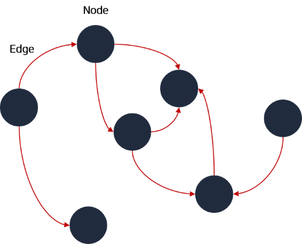

# 그래프

### 1. 그래프



정점과 정점 사이를 연결하는 간선으로 이루어진 비선형 자료구조로, 정점 집합과 간선 집합으로 표현할 수 있다. (ex : 인간 관계도)

#### 특징

* 정점은 여러 개의 간선을 가질 수 있다.
* 크게 방향 그래프와 무방향 그래프로 나눌 수 있다.
* 간선은 가중치를 가질 수 있다.
* 사이클이 발생할 수 있다.

\


### 2. 그래프 종류

* 무방향 그래프 : 간선으로 이어진 점끼리 양방향 이동 가능한 그래프
* 방향 그래프 : 간선에 방향성이 존재하는 그래프
* 연결 그래프 : 모든 정점이 서로 이동 가능한 상태인 그래프
* 비연결 그래프 : 특정 정점쌍 사이에 간선이 존재하지 않는 그래프
* 완전 그래프 : 모든 정점끼리 연결된 상태인 그래프

\


### 3. 그래프의 구현 방법


인접 행렬, 인접 리스트 두 가지 방식으로 그래프를 표현할 수 있다.

\


### 4. 자바스크립트로 구현

#### 인접 행렬

```javascript
const graph = Array.from(Array(5), () => Array(5).fill(false));

graph[0][1] = true;
graph[0][3] = true;
graph[1][2] = true;
graph[2][0] = true;
graph[2][4] = true;
graph[3][2] = true;
graph[4][0] = true;
```

#### 인접 리스트

```javascript
const graph = Array.from(Array(5), () => []);

graph[0].push(1);
graph[0].push(3);
graph[1].push(2);
graph[2].push(0);
graph[2].push(4);
graph[3].push(2);
graph[4].push(0);
```

\
