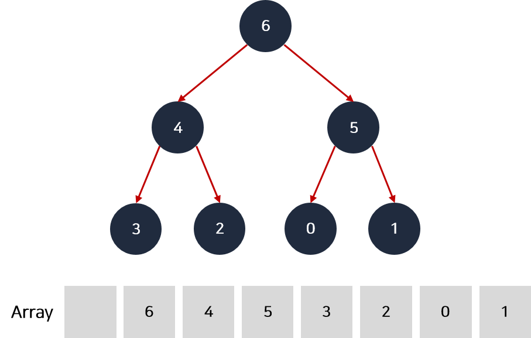

# 힙

### 1. 우선 순위 큐

FIFO 인 큐와 달리 우선순위가 높은 요소가 먼저 나가는 큐

\


### 2. 힙



이진 트리 형태를 가지며 우선 순위가 높은 요소가 먼저 나가기 위해 요소가 삽입, 삭제될 때 바로 정렬되는 특징이 있다.

#### 특징

* 우선순위가 높은 요소가 먼저 나가는 특징을 가진다.
* 루트가 가장 큰 값이 되는 최대 힙과 루트가 가장 작은 값이 되는 최소 힙이 있다.
* 자바스크립트에서는 직접 구현해서 사용해야 한다.

#### 힙 요소 추가 알고리즘

* 요소가 추가될 때는 트리의 가장 마지막 정점에 위치한다.
* 추가 후, 부모 정점보다 우선순위가 높다면 부모 정점과 순서를 바꾼다.
* 이 과정을 반복하면 결국 가장 우선순위가 높은 정점이 루트가 된다.
* 완전 이진 트리의 높이는 logN이기에 힙의 요소 추가 알고리즘은 O(logN) 시간 복잡도를 가진다.

#### 힙 요소 제거 알고리즘

* 요소 제거는 루트 정점만 가능하다.
* 루트 정점이 제거된 후, 가장 마지막 정점이 루트에 위치한다.
* 루트 저점의 두 자식 정점 중 더 우선순위가 높은 정점과 바꾼다.
* 두 자식 정점이 우선순위가 더 낮을 때 까지 반복한다.
* 완전 이진 트리의 높이는 logN이기에 힙의 요소 삭제 알고리즘은 O(logN) 시간 복잡도를 가진다.

\


### 4. 자바스크립트로 구현

```javascript
class MaxHeap {
  constructor() {
    this.heap = [null];
  }

  push(value) {
    this.heap.push(value);

    let currentIndex = this.heap.length - 1;
    let parentIndex = Math.floor(currentIndex / 2);

    while (parentIndex !== 0 && this.heap[parentIndex] < value) {
      const temp = this.heap[parentIndex];

      this.heap[parentIndex] = value;
      this.heap[currentIndex] = temp;

      currentIndex = parentIndex;
      parentIndex = Math.floor(currentIndex / 2);
    }
  }

  pop() {
    const returnValue = this.heap[1];
    this.heap[1] = this.heap.pop();

    let currentIndex = 1;
    let leftIndex = 2;
    rightIndex = 3;

    while (
      this.heap[currentIndex] < this.heap[leftIndex] ||
      this.heap[currentIndex] < this.heap[rightIndex]
    ) {
      if (this.heap[leftIndex] < this.heap[rightIndex]) {
        const temp = this.heap[currentIndex];
        this.heap[currentIndex] = this.heap[rightIndex];
        this.heap[rightIndex] = temp;
        currentIndex = rightIndex;
      } else {
        const temp = this.heap[currentIndex];
        this.heap[currentIndex] = this.heap[leftIndex];
        this.heap[leftIndex] = temp;
        currentIndex = leftIndex;
      }

      leftIndex = current * 2;
      rightIndex = current * 2 + 1;
    }

    return returnValue;
  }
}

const heap = new MaxHep();
heap.push(45);
heap.push(36);
heap.push(54);
heap.push(27);
heap.push(63);
console.log(heap.heap); // [null, 63, 54, 45, 27, 36]

const array = [];
array.push(heap.pop());
array.push(heap.pop());
array.push(heap.pop());
array.push(heap.pop());
array.push(heap.pop());
console.log(array); // [63, 54, 45, 36, 27]
```

\


### 5. 문제 풀기 - 배상 비용 최소화

OO 조선소에서는 태풍으로 인한 작업지연으로 수주한 선박들을 기한 내에 완성하지 못할 것이 예상됩니다.\
기한 내에 완성하지 못하면 손해 배상을 해야 하므로 남은 일의 작업량을 숫자로 매기고 배상 비용을 최소화하는 방법을 찾으려고 합니다.\
_배상 비용은 각 선박의 완성까지 남은 일의 작업량을 제곱하여 모두 더한값이 됩니다._\
조선소에서는 1시간 동안 남은 일 중 하나를 골라 작업량 1만큼 처리할 수 있습니다.\
조선소에서 작업할 수 있는 N 시간과 각 일에 대한 작업량이 담긴 배열(works) 이 있을 때, 배상 비용을 최소화한 결과를 반환해주는 함수를 만들어 주세요.\
예를 들어, N=4 일때, 선박별로 남은 일의 작업량이 works = \[4, 3, 3] 이라변 배상 비용을 최소화히기 위해 일을 한 결과는 \[2, 2, 2]가 되고 배상 비용은 2^2 + 2^2 + 2^2 = 12 가 되어 12를 반환해줍니다.

```javascript
class MaxHeap {
  constructor() {
    this.heap = [null];
  }

  push(value) {
    this.heap.push(value);

    let currentIndex = this.heap.length - 1;
    let parentIndex = Math.floor(currentIndex / 2);

    while (parentIndex !== 0 && this.heap[parentIndex] < value) {
      const temp = this.heap[parentIndex];
      this.heap[parentIndex] = value;
      this.heap[currentIndex] = temp;

      currentIndex = parentIndex;
      parentIndex = Math.floor(currentIndex / 2);
    }
  }

  pop() {
    if (this.heap.length === 2) return this.heap.pop(); // 루트 정점만 남은 경우

    const returnValue = this.heap[1];
    this.heap[1] = this.heap.pop();

    let currentIndex = 1;
    let leftIndex = 2;
    let rightIndex = 3;
    while (
      this.heap[currentIndex] < this.heap[leftIndex] ||
      this.heap[currentIndex] < this.heap[rightIndex]
    ) {
      if (this.heap[leftIndex] < this.heap[rightIndex]) {
        const temp = this.heap[currentIndex];
        this.heap[currentIndex] = this.heap[rightIndex];
        this.heap[rightIndex] = temp;
        currentIndex = rightIndex;
      } else {
        const temp = this.heap[currentIndex];
        this.heap[currentIndex] = this.heap[leftIndex];
        this.heap[leftIndex] = temp;
        currentIndex = leftIndex;
      }

      leftIndex = currentIndex * 2;
      rightIndex = currentIndex * 2 + 1;
    }

    return returnValue;
  }
}

function solution(no, works) {
  // 모든 작업의 합보다 no가 크면 배상 비용을 낼 필요가 없다.
  if (works.reduce((a, b) => a + b) <= no) {
    return 0;
  }

  // max heap 구성
  const heap = new MaxHeap();
  for (const work of works) {
    heap.push(work);
  }

  // no 만큼 루프를 돌면서 가장 큰 값을 빼서 처리 후, 다시 push
  for (let i = 0; i < no; i++) {
    heap.push(heap.pop() - 1);
  }

  // 남은 요소에 제곱한 값들의 합을 구한 후, 반환
  return heap.heap.reduce((a, b) => a + b * b);
}
```

\
