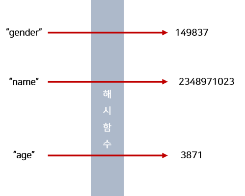

# 해시 테이블

### 1. 해시 테이블

.png>)

키와 값을 받아 키를 해싱하여 나온 index 에 값을 저장하는 선형구조다.\
삽입은 O(1) 이며, 키를 알고 있다면 삭제와 탐색도 O(1) 이다.

\


### 2. 해시 함수



입력 받은 특정 범위 내 숫자로 변경하는 함수

\


### 3. 해시 충돌

* 선형 탐사법 : 충돌이 발생하면 옆으로 한칸 이동한다.
* 제곱 탐사법 : 충돌이 발생하면 발생한 횟수의 제곱만큼 옆으로 이동한다.
* 이중 해싱 : 충돌이 발생하면 다른 해시 함수를 이용한다.
* 분리 연결법 : 버킷의 값을 연결 리스트로 사용하여 충돌이 발생하면 리스트에 값을 추가한다.

\


### 4. 자바스크립트로 구현

#### Object

```javascript
const table = {};
table["key"] = 100;
table["key2"] = "Hello";
console.log(table["key"]); // 100

table["key"] = 349;
console.log(table["key"]); // 349

delete table["key"];
console.log(table["key"]); // undefined
```

#### Map - 다양한 타입을 사용할 때

```javascript
const table = new Map();
table.set("key", 100);
table.set("key2", "Hello");
console.log(table.get("key")); // 100;

const object = { a: 1 };
table.set(object, "A1");
console.log(table.get(object)); // A1;
table.delete(object);
console.log(table.get(object)); // undefined

console.log(table.keys()); // {"key", "key2"}
console.log(table.values()); // {100, "Hello"}
table.clear();
console.log(table.values()); // { }
```

\


### 5. 문제 풀기 - 베스트 앨범

스트리밍 사이트에서 장르별로 가장 많이 재생된 노래를 두 개씩 모아 베스트 앨범을 출시하려 합니다.\
노래는 고유 번호로 구분하며, 노래를 수록하는 기준은 다음과 같습니다.

> 1. 속한 노래가 많이 재생된 장르를 먼저 수록합니다.
> 2. 장르 내에서 많이 재생된 노래를 먼저 수록합니다.
> 3. 장르 내에에서 재생 횟수가 같은 노래 중에서는 고유 번호가 낮은 노래를 먼저 수록합니다.

노래의 장르를 나타내는 문자열 배열 genres 와 노래별 재생 횟수를 나타내는 정수 배열 plays 가 주어질 때, 베스트 앨범이 들어갈 노래의 고유 번호를 순서대로 return 하도록 solution 함수를 완성하세요.

```javascript
function solution(genres, plays) {
  const genreMap = new Map();

  genres
    .map((genre, index) => [genre, plays[index]])
    .forEach(([genre, play], index) => {
      const data = genreMap.get(genre) || { total: 0, songs: [] };
      genreMap.set(genre, {
        total: data.total + play,
        songs: [...data.songs, { play, index }]
          .sort((a, b) => b.play - a.play)
          .slice(0, 2),
      });
    });

  return [...genreMap.entries()]
    .sort((a, b) => b[1].total - a[1].total)
    .flatMap((item) => item[1].songs)
    .map((song) => song.index);
}
```

\
